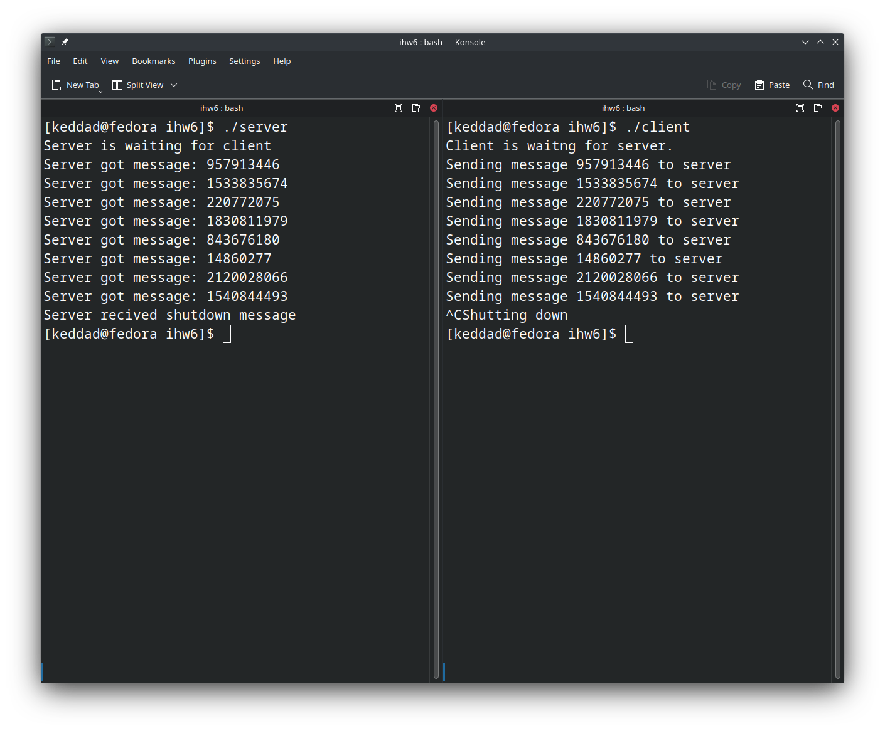

# ДЗ6

Бирюлин Никита, БПИ213

Реализовано клиент-серверное приложение, демонстрирующее обмен данными через shared memory. Клиент и сервер доступен в client.c и server.c соответственно, некоторый общий код доступен в shared.h. Для сборки:

```
make client server
```

Ожидается, что перед запуском клиента сервер уже будет запущен. (Если это не так, клиент откажется запускаться с соответствующей ошибкой). Пример работы:



Основная логика приложения такова:
* Выделяется область общей памяти, содержащая в себе структуру данных для обмена информацией:
```c
struct shared {
    int shutdown;
    int message;
};
```

* Выделяется блок из двух семафоров, каждый из которых принимает значение от 0 до 1. Они работают как мьютексы, блокируя то клиент, то сервер (более подробное описание есть в server.c)

* Попеременно клиент и сервер разблокируют друг друга, после чего блокируют себя (клиент при этом записывает число в общую память, сервер его печатает)

* Если клиент выставляет в общей памяти флаг shutdown (Это происходит при получении сигнала завершения клиентом, например, при Ctrl+C), то:
    * Клиент разблокирует сервер
    * Клиент отключает (shmdt) общую область памяти (т.к. она не удалится пока ее использует хоть один процесс)
    * Клиент завершается
    * Разблокированный сервер удаляет семафоры, память, тоже завершается

* Таким образом достигается корректное завершение (единственное ограничение - завершение всегда инициализируется клиентом).