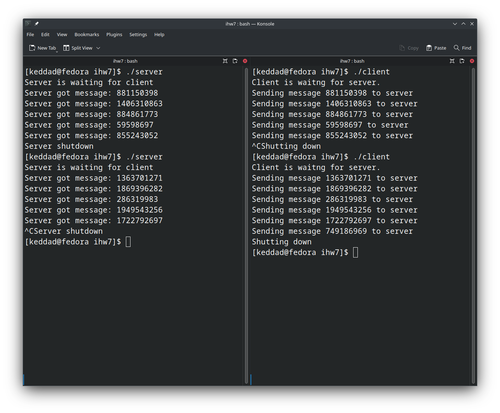

# ДЗ7

Бирюлин Никита, БПИ213

Реализовано клиент-серверное приложение, демонстрирующее обмен данными через shared memory. Клиент и сервер доступен в client.c и server.c соответственно, некоторый общий код доступен в shared.h. Приложение почти полностью копирует приложение из ДЗ6, но использует POSIX. Для сборки:

```
make client server
```

Ожидается, что перед запуском клиента сервер уже будет запущен.  Пример работы:



Основная логика приложения такова:
* Выделяется область общей памяти, содержащая в себе структуру данных для обмена информацией:
```c
struct shared {
    int shutdown;
    int message;
};
```

* Выделяется блок из двух семафоров, каждый из которых принимает значение от 0 до 1. Они работают как мьютексы, блокируя то клиент, то сервер.

* Попеременно клиент и сервер разблокируют друг друга, после чего блокируют себя (клиент при этом записывает число в общую память, сервер его печатает).

* При Ctrl+C как на клиенте, так и на сервере (в моей ДЗ6 отключение мог иницилизировать только клиент, эта ошибка исправлена) в общую структуру данных записывается флаг отключения, сначала отключается клиент, потом отключается сервер. Ресурсы очищаются.